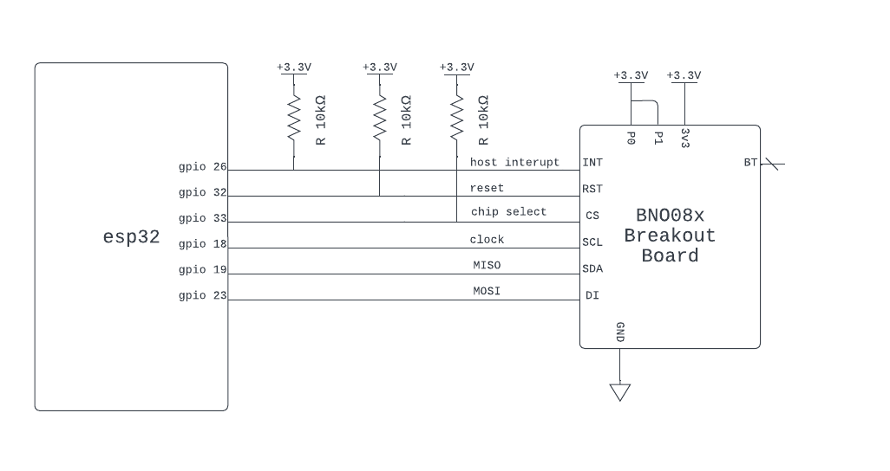

<a name="readme-top"></a>

<summary>Table of Contents</summary>
<ol>
<li>
    <a href="#about">About</a>
</li>
<li>
    <a href="#getting-started">Getting Started</a>
    <ul>
    <li><a href="#wiring">Wiring</a></li>
    <li><a href="#adding-to-project">Adding to Project</a></li>
    </ul>
</li>
<li><a href="#example">Example</a></li>
<li><a href="#documentation">Documentation</a></li>
<li><a href="#acknowledgements">Acknowledgements</a></li>  <!-- Added this line -->
<li><a href="#license">License</a></li>
<li><a href="#contact">Contact</a></li>
</ol>

<!-- ABOUT -->
## About

esp32_BNO08x is a C++ esp-idf v5.x component, intended to serve as a driver for both the BNO080 and BNO085 IMUs.  
This library is heavy influenced by the  SparkFun BNO080 Arduino Library, it is more or less a port. It supports access to all the same data that the BNO08x provides.    
Currently, only SPI is supported, there is no plans to support I2C (esp32 has I2C driver silicone bug, leading to unpredictable behavior).   
I may implement UART at some point in the future.

## Getting Started
<p align="right">(<a href="#readme-top">back to top</a>)</p>

### Wiring
The default wiring is depicted below, it can be changed at driver initialization (see example section).

<p align="right">(<a href="#readme-top">back to top</a>)</p>

### Adding to Project
1. Create a "components" directory in the root workspace directory of your esp-idf project if it does not exist already.  

   In workspace directory:     
   ```sh
   mkdir components
   ```


2. Cd into the components directory and clone the esp32_BNO08x repo.

   ```sh
   cd components
   git clone https://github.com/myles-parfeniuk/esp32_BNO08x.git
   ```

3. Ensure you clean your esp-idf project before rebuilding.  
   Within esp-idf enabled terminal:
   ```sh
    idf.py fullclean
   ```
<p align="right">(<a href="#readme-top">back to top</a>)</p>

### Example
```cpp  
#include <stdio.h>
#include "BNO08x.hpp"

extern "C" void app_main(void)
{
    BNO08x imu; //create IMU object with default wiring scheme

    //if a custom wiring scheme is desired instead of default:

    /*
    bno08x_config_t imu_config;     //create config struct
    imu_config.io_mosi = GPIO_NUM_X; //assign pin
    imu_config.io_miso = GPIO_NUM_X; //assign pin
    //etc...
    BNO08x imu(imu_config); //pass config to BNO08x constructor
    */
    

    imu.initialize();  //initialize IMU

    //enable gyro & game rotation vector
    imu.enable_game_rotation_vector(100);
    imu.enable_gyro(150);

    while(1)
    {
        //print absolute heading in degrees and angular velocity in Rad/s
        if(imu.data_available())
        {
            ESP_LOGW("Main", "Velocity: x: %.3f y: %.3f z: %.3f", imu.get_gyro_calibrated_velocity_X(), imu.get_gyro_calibrated_velocity_Y(), imu.get_gyro_calibrated_velocity_Z());
            ESP_LOGI("Main", "Euler Angle: x (roll): %.3f y (pitch): %.3f z (yaw): %.3f", imu.get_roll_deg(), imu.get_pitch_deg(), imu.get_yaw_deg());
        }
    }

}
```
<p align="right">(<a href="#readme-top">back to top</a>)</p>

## Documentation
API documentation generated with doxygen can be found in the documentation directory of the master branch.  
<p align="right">(<a href="#readme-top">back to top</a>)</p>

## Acknowledgements

Special thanks to the original creators of the sparkfun BNO080 library. Developing this without a reference would have been much more time consuming.  
https://github.com/sparkfun/SparkFun_BNO080_Arduino_Library  

Special thanks to Anton Babiy, aka hwBirdy007 for helping with debugging SPI.   
https://github.com/hwBirdy007  

<p align="right">(<a href="#readme-top">back to top</a>)</p>

## License

Distributed under the MIT License. See `LICENSE.md` for more information.
<p align="right">(<a href="#readme-top">back to top</a>)</p>

## Contact

Myles Parfeniuk - myles.parfenyuk@gmail.com

Project Link: [https://github.com/myles-parfeniuk/esp32_BNO08x.git](https://github.com/myles-parfeniuk/esp32_BNO08x.git)
<p align="right">(<a href="#readme-top">back to top</a>)</p>