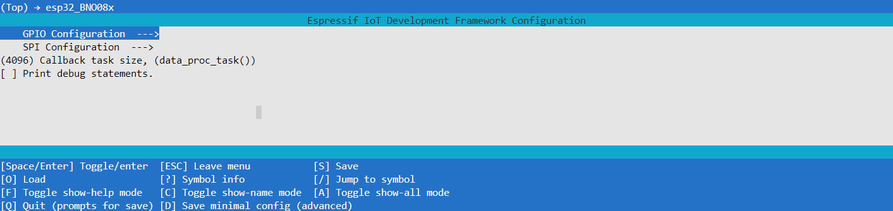

<a name="readme-top"></a>

<summary>Table of Contents</summary>
<ol>
<li>
    <a href="#about">About</a>
</li>
<li>
    <a href="#getting-started">Getting Started</a>
    <ul>
    <li><a href="#wiring">Wiring</a></li>
    <li><a href="#adding-to-project">Adding to Project</a></li>
    <li><a href="#menuconfig">Menuconfig</a></li>
    <li><a href="#examples">Examples</a></li>
    </ul>
</li>
<li><a href="#documentation">Documentation</a></li>
<li><a href="#program-flowcharts">Program Flowcharts</a></li>
<li><a href="#acknowledgements">Acknowledgements</a></li>  <!-- Added this line -->
<li><a href="#license">License</a></li>
<li><a href="#contact">Contact</a></li>
</ol>

## About

esp32_BNO08x is a C++ component for esp-idf v5.x, serving as a driver for both BNO080 and BNO085 IMUs.  

Originally based on the SparkFun BNO080 Arduino Library, it has since diverged significantly in implementation while retaining all original features and more, including callback functions enabled by its multi-tasked approach.

Currently, only SPI is supported. There are no plans to support I2C due to unpredictable behavior caused by an esp32 I2C driver silicon bug. UART support may be implemented in the future.

## Getting Started
<p align="right">(<a href="#readme-top">back to top</a>)</p>

### Wiring
The default wiring is depicted below, it can be changed at driver initialization (see example section).  

If your ESP does not have the GPIO pin numbers depicted below, you **must change the default GPIO settings in menuconfig**. See the Menuconfig section. 


<p align="right">(<a href="#readme-top">back to top</a>)</p>

### Adding to Project
1. Create a "components" directory in the root workspace directory of your esp-idf project if it does not exist already.  

   In workspace directory:     
   ```sh
   mkdir components
   ```


2. Cd into the components directory and clone the esp32_BNO08x repo.

   ```sh
   cd components
   git clone https://github.com/myles-parfeniuk/esp32_BNO08x.git
   ```

3. Ensure you clean your esp-idf project before rebuilding.  
   Within esp-idf enabled terminal:
   ```sh
    idf.py fullclean
   ```
<p align="right">(<a href="#readme-top">back to top</a>)</p>

### Menuconfig
This library provides a menuconfig menu configured in Kconfig.projbuild. It contains settings to control the default GPIO and a few other things.  

To access the menu:

1. Within esp-idf enabled terminal, execute the menuconfig command:
    ```sh
    idf.py menuconfig

2. Scroll down to the esp_BNO08x menu and enter it, if you're using vsCode you may have to use the "j" and "k" keys instead of the arrow keys.
    

3. Modify whatever settings you'd like from the sub menus. The GPIO Configuration menu allows for the default GPIO pins to be modified, the SPI Configuration menu allows for the default SCLK frequency and host peripheral to be modified.
    
<p align="right">(<a href="#readme-top">back to top</a>)</p>

### Examples
There are two ways data returned from the BNO08x can be accessed with this library:

1. Polling Method with `data_available()` Function:
  - Use the `data_available()` function to poll for new data, similar to the SparkFun library.
  - Behavior: It is a blocking function that returns `true` when new data is received or `false` if a timeout occurs.
  - See the **Polling Example** below.

2. Callback Registration with `register_cb()` Function:
  - Register callback functions that automatically execute upon receiving new data.
  - Behavior: The registered callback will be invoked whenever new data is available.
  - See the **Call-Back Function Example** below. 
  
#### Polling Example
```cpp  
#include <stdio.h>
#include "BNO08x.hpp"

extern "C" void app_main(void)
{
    BNO08x imu; //create IMU object with default wiring scheme
    float x, y, z = 0;

    //if a custom wiring scheme is desired instead of default:

    /*
    bno08x_config_t imu_config;     //create config struct
    imu_config.io_mosi = GPIO_NUM_X; //assign pin
    imu_config.io_miso = GPIO_NUM_X; //assign pin
    //etc...
    BNO08x imu(imu_config); //pass config to BNO08x constructor
    */
    

    imu.initialize();  //initialize IMU

    //enable gyro & game rotation vector
    imu.enable_game_rotation_vector(100000UL); //100,000us == 100ms report interval
    imu.enable_gyro(150000UL); //150,000us == 150ms report interval 

    while(1)
    {
        //print absolute heading in degrees and angular velocity in Rad/s
        if(imu.data_available())
        {
            x = imu.get_gyro_calibrated_velocity_X();
            y = imu.get_gyro_calibrated_velocity_Y();
            z = imu.get_gyro_calibrated_velocity_Z();
            ESP_LOGW("Main", "Velocity: x: %.3f y: %.3f z: %.3f", x, y, z);

            x = imu.get_roll_deg();
            y = imu.get_pitch_deg();
            z = imu.get_yaw_deg();
            ESP_LOGI("Main", "Euler Angle: x (roll): %.3f y (pitch): %.3f z (yaw): %.3f", x, y, z);
        }
    }

}
```

#### Call-Back Function Example
```cpp
#include <stdio.h>
#include "BNO08x.hpp"

extern "C" void app_main(void)
{
    BNO08x imu; // create IMU object with default wiring scheme

    // if a custom wiring scheme is desired instead of default:

    /*
    bno08x_config_t imu_config;     //create config struct
    imu_config.io_mosi = GPIO_NUM_X; //assign pin
    imu_config.io_miso = GPIO_NUM_X; //assign pin
    //etc...
    BNO08x imu(imu_config); //pass config to BNO08x constructor
    */

    imu.initialize(); // initialize IMU

    // enable gyro & game rotation vector
    imu.enable_game_rotation_vector(100000UL); // 100,000us == 100ms report interval
    imu.enable_gyro(150000UL);                 // 150,000us == 150ms report interval

    // register a callback function (in this case a lambda function, but it doesn't have to be)
    imu.register_cb(
        [&imu]()
        {
            // callback function contents, executed whenever new data is parsed
            // print absolute heading in degrees and angular velocity in Rad/s
            float x, y, z = 0;
            x = imu.get_gyro_calibrated_velocity_X();
            y = imu.get_gyro_calibrated_velocity_Y();
            z = imu.get_gyro_calibrated_velocity_Z();
            ESP_LOGW("Main", "Velocity: x: %.3f y: %.3f z: %.3f", x, y, z);

            x = imu.get_roll_deg();
            y = imu.get_pitch_deg();
            z = imu.get_yaw_deg();
            ESP_LOGI("Main", "Euler Angle: x (roll): %.3f y (pitch): %.3f z (yaw): %.3f", x, y, z);
        });

    while (1)
    {
        vTaskDelay(300 / portTICK_PERIOD_MS); // delay here is irrelevant, we just don't want to trip cpu watchdog
    }
}
```
<p align="right">(<a href="#readme-top">back to top</a>)</p>

## Documentation
API documentation generated with doxygen can be found in the documentation directory of the master branch.  
<p align="right">(<a href="#readme-top">back to top</a>)</p>

## Program Flowcharts
The following charts illustrate the program flow this library implements for sending and receiving data from BNO08x.  
These are here to aid development for anyone looking to modify, fork, or contribute.  


<p align="right">(<a href="#readme-top">back to top</a>)</p>


## Acknowledgements
Special thanks to the original creators of the sparkfun BNO080 library. Developing this without a reference would have been much more time consuming.  
https://github.com/sparkfun/SparkFun_BNO080_Arduino_Library  

Special thanks to Anton Babiy, aka hwBirdy007 for helping with debugging SPI.   
https://github.com/hwBirdy007  

<p align="right">(<a href="#readme-top">back to top</a>)</p>

## License

Distributed under the MIT License. See `LICENSE.md` for more information.
<p align="right">(<a href="#readme-top">back to top</a>)</p>

## Contact

Myles Parfeniuk - myles.parfenyuk@gmail.com

Project Link: [https://github.com/myles-parfeniuk/esp32_BNO08x.git](https://github.com/myles-parfeniuk/esp32_BNO08x.git)
<p align="right">(<a href="#readme-top">back to top</a>)</p>