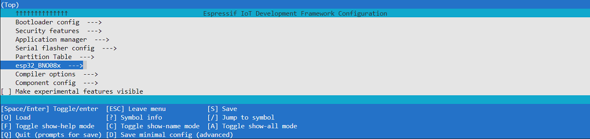
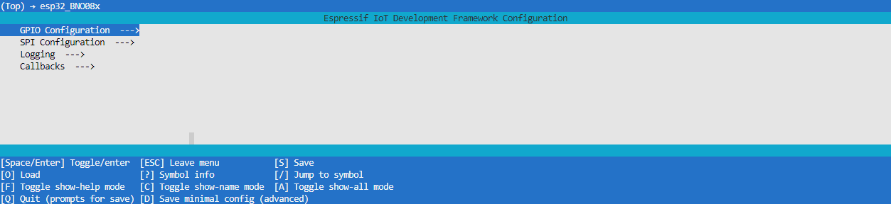
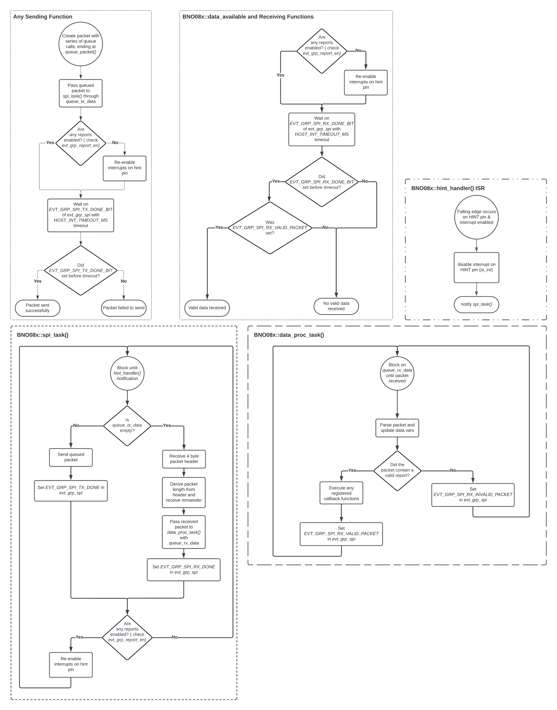

<a name="readme-top"></a>

<summary>Table of Contents</summary>
<ol>
<li>
    <a href="#about">About</a>
</li>
<li>
    <a href="#getting-started">Getting Started</a>
    <ul>
    <li><a href="#wiring">Wiring</a></li>
    <li><a href="#adding-to-project">Adding to Project</a></li>
    <li><a href="#menuconfig">Menuconfig</a></li>
    <li><a href="#examples">Examples</a></li>
    </ul>
</li>
<li>
    <a href="#unit-tests">Unit Tests</a>
    <ul>
        <li><a href="#running-tests">Running Tests</a></li>
        <li><a href="#adding-tests">Adding Tests</a></li>
    </ul>
</li>
<li><a href="#documentation">Documentation</a></li>
<li><a href="#program-flowcharts">Program Flowcharts</a></li>
<li><a href="#acknowledgements">Acknowledgements</a></li>  <!-- Added this line -->
<li><a href="#license">License</a></li>
<li><a href="#contact">Contact</a></li>
</ol>

## About

esp32_BNO08x is a C++ component for esp-idf v5.x, serving as a driver for both BNO080 and BNO085 IMUs.  

Originally based on the SparkFun BNO080 Arduino Library, it has since diverged significantly in implementation, taking a multi-tasked approach to avoid wasting CPU time polling the HINT pin of the IMU. Currently, only SPI is supported. There are no plans to support I2C due to unpredictable behavior caused by an esp32 I2C driver silicon bug. UART support may be implemented in the future.

**NOTE: If you are here because this most recent update broke your code:**  
You can still use the old version on the `no_sh2_HAL` branch of this repo. It will no longer receive support. It's highly recommended you update your code base to this version as it uses the official [Hillcrest Labs sh2 HAL lib](https://github.com/ceva-dsp/sh2) to handle sh2 SHTP communication with the IMU, instead of my own implementation. It is better tested and more reliable at the cost of slightly more overhead. 
<p align="right">(<a href="#readme-top">back to top</a>)</p>

## Getting Started
<p align="right">(<a href="#readme-top">back to top</a>)</p>

### Wiring
The default wiring is depicted below, it can be changed at driver initialization (see example section).  

**If your ESP does not have the GPIO pin numbers depicted below, you must change the default GPIO settings in menuconfig**. See the Menuconfig section. 


<p align="right">(<a href="#readme-top">back to top</a>)</p>

### Adding to Project
1. Create a "components" directory in the root workspace directory of your esp-idf project if it does not exist already.  

   In workspace directory:     
   ```sh
   mkdir components
   ```


2. Cd into the components directory and clone the esp32_BNO08x repo.

   ```sh
   cd components
   git clone https://github.com/myles-parfeniuk/esp32_BNO08x.git
   ```

3. Ensure you clean your esp-idf project before rebuilding.  
   Within esp-idf enabled terminal:
   ```sh
    idf.py fullclean
   ```
<p align="right">(<a href="#readme-top">back to top</a>)</p>

### Menuconfig
This library provides a menuconfig menu configured in Kconfig.projbuild. It contains settings to control the default GPIO and a few other things.  

To access the menu:

1. Within esp-idf enabled terminal, execute the menuconfig command:
    ```sh
    idf.py menuconfig
    ```
2. Scroll down to the esp_BNO08x menu and enter it, if you're using vsCode you may have to use the "j" and "k" keys instead of the arrow keys.
    

3. Modify whatever settings you'd like from the sub menus.  
    
    - The GPIO Configuration menu allows for the default GPIO pins to be modified.
    - The SPI Configuration menu allows for the default host peripheral, SCLK frequency, and SPI queue size to be modified.
    - The Tasks menu allows for the stack size of the three tasks utilized by this library to be modified. 
    - The Callbacks menu allows for the size of the callback queue and maximum amount of callbacks to be modified. 
    - The Timeouts menu allows the length of various timeouts/delays to be set.
    - The Logging menu allows for the enabling and disabling of serial log/print statements for production code.
<p align="right">(<a href="#readme-top">back to top</a>)</p>

### Examples
There are two ways data returned from the BNO08x can be accessed with this library:

1. **Polling Method with** `data_available()` **Function**:
  - See the **Polling Example** below.

2. **Callback Registration with** `register_cb()` **Function**:
  - See the **Call-Back Function Example** below. 
  
#### Polling Example
```cpp  
#include <stdio.h>
#include "BNO08x.hpp"

static const constexpr char *TAG = "Main";

extern "C" void app_main(void)
{
    static BNO08x imu;
    // if a custom wiring scheme is desired instead of default:

    /*
    bno08x_config_t imu_config;        //create config struct
    imu_config.io_mosi = GPIO_NUM_X;   //assign pin
    imu_config.io_miso = GPIO_NUM_X;   //assign pin
    //etc...
    BNO08x imu(imu_config);            //pass config to BNO08x constructor
    */

    // initialize imu
    if (!imu.initialize())
    {
        ESP_LOGE(TAG, "Init failure, returning from main.");
        return;
    }

    // enable game rotation vector and calibrated gyro reports
    imu.rpt.rv_game.enable(100000UL);  // 100,000us == 100ms report interval
    imu.rpt.cal_gyro.enable(100000UL); // 100,000us == 100ms report interval

    while (1)
    {
        // block until new report is detected
        if (imu.data_available())
        {
            // check for game rotation vector report
            if (imu.rpt.rv_game.has_new_data())
            {
                // get absolute heading in degrees
                bno08x_euler_angle_t euler = imu.rpt.rv_game.get_euler();
                // display heading
                ESP_LOGI(TAG, "Euler Angle: x (roll): %.2f y (pitch): %.2f z (yaw): %.2f", euler.x, euler.y, euler.z);
            }

            // check for cal gyro report
            if (imu.rpt.cal_gyro.has_new_data())
            {
                // get angular velocity in rad/s
                bno08x_gyro_t velocity = imu.rpt.cal_gyro.get();
                // display velocity
                ESP_LOGW(TAG, "Velocity: x: %.2f y: %.2f z: %.2f", velocity.x, velocity.y, velocity.z);
            }
        }
    }
}
```
- Initialize the IMU and enable desired reports. 
- Use the `data_available()` function to poll for new data, similar to the SparkFun library.
- Behavior: It is a blocking function that returns `true` when new data is received or `false` if a timeout occurs.
- Check for report flavor received if desired, with `has_new_data()`

#### Call-Back Function Example
```cpp
#include <stdio.h>
#include "BNO08x.hpp"

static const constexpr char *TAG = "Main";

extern "C" void app_main(void)
{
    static BNO08x imu;
    // if a custom wiring scheme is desired instead of default:

    /*
    bno08x_config_t imu_config;        //create config struct
    imu_config.io_mosi = GPIO_NUM_X;   //assign pin
    imu_config.io_miso = GPIO_NUM_X;   //assign pin
    //etc...
    BNO08x imu(imu_config);            //pass config to BNO08x constructor
    */

    // initialize imu
    if (!imu.initialize())
    {
        ESP_LOGE(TAG, "Init failure, returning from main.");
        return;
    }

    // enable game rotation vector and calibrated gyro reports
    imu.rpt.rv_game.enable(100000UL);  // 100,000us == 100ms report interval
    imu.rpt.cal_gyro.enable(100000UL); // 100,000us == 100ms report interval
    

    // There are 3 different flavors of callbacks available:

    // 1) register a callback to execute when new data is received for any report
    imu.register_cb([&imu]()
                    {
                        // check for game rotation vector report
                        if (imu.rpt.rv_game.has_new_data())
                        {
                            // get absolute heading in degrees
                            bno08x_euler_angle_t euler = imu.rpt.rv_game.get_euler();
                            // display heading
                            ESP_LOGI(TAG, "Euler Angle: x (roll): %.2f y (pitch): %.2f z (yaw): %.2f", euler.x, euler.y, euler.z);
                        } 
                    });

    // 2) register a callback that is only executed for a specific report
    imu.rpt.cal_gyro.register_cb([&imu]()
                                 {
                                    // get angular velocity in rad/s
                                    bno08x_gyro_t velocity = imu.rpt.cal_gyro.get();
                                    // display velocity
                                    ESP_LOGI(TAG, "Velocity: x: %.2f y: %.2f z: %.2f", velocity.x, velocity.y, velocity.z); 
                                });

    // 3) register a callback this passed report ID of report that asserted callback
    imu.register_cb([](uint8_t rpt_ID)
                    {
                        switch (rpt_ID)
                        {
                            case SH2_GAME_ROTATION_VECTOR:
                                ESP_LOGW(TAG, "Game RV report RX");
                                break;

                            case SH2_CAL_GYRO:
                                ESP_LOGW(TAG, "Cal Gyro report RX");
                                break;

                            default:

                                break;
                        } 
                    });

    while (1)
    {
        vTaskDelay(10000UL / portTICK_PERIOD_MS); // delay here is irrelevant, we just don't want to trip cpu watchdog
    }
}
```
- Register callback functions that automatically execute upon receiving new data.
- Behavior: The registered callback will be invoked whenever new data is available.
- It is possible to register a callback to one report, or all reports. 
<p align="right">(<a href="#readme-top">back to top</a>)</p>

## Unit Tests
A basic unit testing suite is included with this library, but it is very rudimentary.  
It can be used to verify some of the basic features of a BNO08x device and this library.
<p align="right">(<a href="#readme-top">back to top</a>)</p>

### Running Tests
1. Create a project and add the component as described in the getting started guide. 


2. Open the outermost CMakeLists.txt file in the project root directory, as depicted below.  

    

3. Modify the file by adding "set(TEST_COMPONENTS "esp32_BNO08x" CACHE STRING "Components to test.")" as depicted below:  

    ```cmake
    # For more information about build system see
    # https://docs.espressif.com/projects/esp-idf/en/latest/api-guides/build-system.html
    # The following five lines of boilerplate have to be in your project's
    # CMakeLists in this exact order for cmake to work correctly
    cmake_minimum_required(VERSION 3.16)
    set(TEST_COMPONENTS "esp32_BNO08x" CACHE STRING "Components to test.") 
    include($ENV{IDF_PATH}/tools/cmake/project.cmake)
    project(your_project_name)
    ```

4. Include the test suite in your main file and launch into the test suite:  

    ```cpp
    #include <stdio.h>
    #include "BNO08xTestSuite.hpp"

    extern "C" void app_main(void)
    {
        BNO08xTestSuite::run_all_tests(); 
    }
    ```

5. Ensure you run `idf.py fullclean` or delete your build directory before building for the first time after modifying the CMakeLists.txt file in step 3. 

<p align="right">(<a href="#readme-top">back to top</a>)</p>

### Adding Tests
Tests are implemented with the [unity unit testing component](https://docs.espressif.com/projects/esp-idf/en/stable/esp32/api-guides/unit-tests.html).

To add a test, create a new .cpp file, or modify one of the existing ones in `esp32_BNO08x/test/`. 
Follow the existing test structure as an example, use the `TEST_CASE(){}` macro, then add a function
to the `esp32BNO08x/include/BNO08xTestSuite.hpp` file to run your test(s).   

Any tests added will automatically be detected at build time. 
<p align="right">(<a href="#readme-top">back to top</a>)</p>

## Documentation
API documentation generated with doxygen can be found in the documentation directory of the master branch.  
<p align="right">(<a href="#readme-top">back to top</a>)</p>

## Program Flowcharts
The following charts illustrate the program flow this library implements to deal with handling sh2 HAL lib in a multi-tasked manner. These are here to aid development for anyone looking to modify, fork, or contribute.  
Sh2 HAL lib handles all communication with the IMU through callbacks which can be viewed in `BNO08xSH2HAL.hpp`. Sh2 HAL lib handles the sh2 SHTP protocol imposed ontop of SPI, while the callbacks give it the means to send/receive over SPI, reset the device, etc...


<p align="right">(<a href="#readme-top">back to top</a>)</p>


## Acknowledgements
Special thanks to Anton Babiy, aka hwBirdy007 for helping with debugging SPI.   
https://github.com/hwBirdy007  

<p align="right">(<a href="#readme-top">back to top</a>)</p>

## License

Distributed under the MIT License. See `LICENSE.md` for more information.
<p align="right">(<a href="#readme-top">back to top</a>)</p>

## Contact

Myles Parfeniuk - myles.parfenyuk@gmail.com

Project Link: [https://github.com/myles-parfeniuk/esp32_BNO08x.git](https://github.com/myles-parfeniuk/esp32_BNO08x.git)
<p align="right">(<a href="#readme-top">back to top</a>)</p>